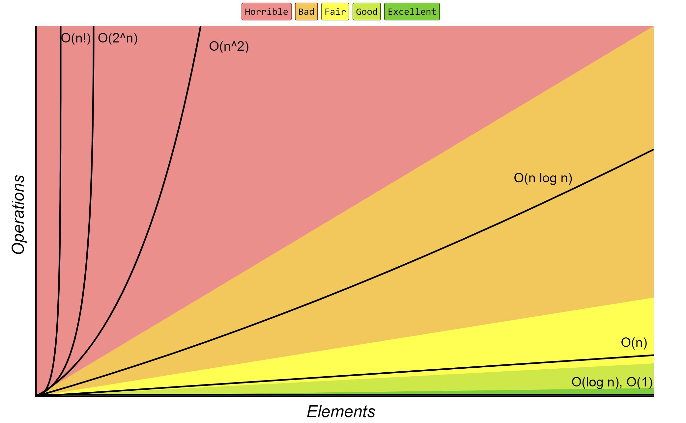
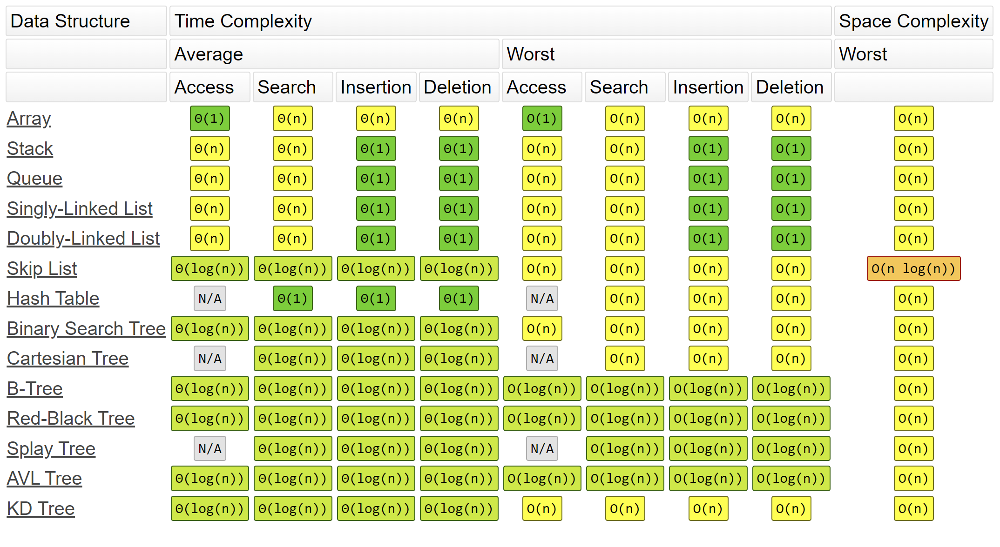
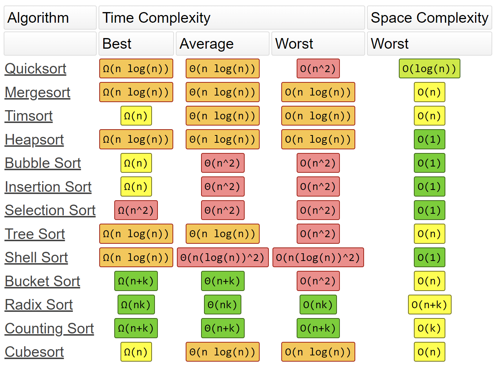

# Big-O Cheat Sheet

## Know Thy Complexities!

Hi there!  This webpage covers the space and time Big-O complexities of common algorithms used in Computer Science.  When preparing for technical interviews in the past, I found myself spending hours crawling the internet putting together the best, average, and worst case complexities for search and sorting algorithms so that I wouldn't be stumped when asked about them.  Over the last few years, I've interviewed at several Silicon Valley startups, and also some bigger companies, like Google, Facebook, Yahoo, LinkedIn, and Uber, and each time that I prepared for an interview, I thought to myself "Why hasn't someone created a nice Big-O cheat sheet?".  So, to save all of you fine folks a ton of time, I went ahead and created one.  Enjoy! - Eric

<h2 id="big-o">Big-O Complexity Chart</h2>

<h2 id="data-structures">Common Data Structure Operations</h2>

<h2 id="sorting">Array Sorting Algorithms</h2>

<h2 id="poster">Big-O Cheat Sheet Poster</h2>

## 来源

- [Big-O Cheat Sheet](https://www.bigocheatsheet.com/)
- [TimSort](https://www.youtube.com/watch?v=_dlzWEJoU7I)
- [Tree Sort](https://www.youtube.com/watch?v=n2MLjGeK7qA)
- [Skip List](https://www.youtube.com/watch?v=UGaOXaXAM5M)
- [B Trees and B+ Trees. How they are useful in Databases](https://www.youtube.com/watch?v=aZjYr87r1b8)
- [AVL Tree - Insertion and Rotations](https://www.youtube.com/watch?v=jDM6_TnYIqE)
- [Red-black trees](https://www.youtube.com/watch?v=qvZGUFHWChY&list=PL9xmBV_5YoZNqDI8qfOZgzbqahCUmUEin)
- [Splay Tree Introduction](https://www.youtube.com/watch?v=IBY4NtxmGg8)
- [K-d tree algorithm](https://www.youtube.com/watch?v=Y4ZgLlDfKDg)
- [All Algorithms implemented in Java](https://github.com/TheAlgorithms/Java)
- [A collection of algorithms and data structures](https://github.com/williamfiset/Algorithms)