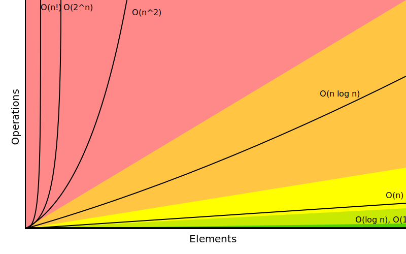

# Big-O Cheat Sheet

## Know Thy Complexities!

Hi there!  This webpage covers the space and time Big-O complexities of common algorithms used in Computer Science.  When preparing for technical interviews in the past, I found myself spending hours crawling the internet putting together the best, average, and worst case complexities for search and sorting algorithms so that I wouldn't be stumped when asked about them.  Over the last few years, I've interviewed at several Silicon Valley startups, and also some bigger companies, like Google, Facebook, Yahoo, LinkedIn, and Uber, and each time that I prepared for an interview, I thought to myself "Why hasn't someone created a nice Big-O cheat sheet?".  So, to save all of you fine folks a ton of time, I went ahead and created one.  Enjoy! - Eric

<h2 id="big-o">Big-O Complexity Chart</h2>
<table id="legend" class="table">
            <tbody>
              <tr>
                <td><code style="border: 1px solid #b20000;
    color: black;
    background-color: #ff8989;">Horrible</code></td>
                <td><code style="    border: 1px solid #b20000;
    color: black;
    background-color: #FFC543;">Bad</code></td>
                <td><code style="    border: 1px solid #6f6e00;
    color: black;
    background-color: yellow;">Fair</code></td>
                <td><code style="    border: 1px solid #286500;
    color: black;
    background-color: #C8EA00;">Good</code></td>
                <td><code style="    border: 1px solid #286500;
    color: black;
    background-color: #53d000;">Excellent</code></td>
              </tr>
            </tbody>
          </table>

<h2 id="data-structures">Common Data Structure Operations</h2>
<table class="table table-bordered table-striped">
    <tr>
      <th>Data Structure</th>
      <th colspan="8">Time Complexity</th>
      <th>Space Complexity</th>
    </tr>
    <tr>
      <th></th>
      <th colspan="4">Average</th>
      <th colspan="4">Worst</th>
      <th>Worst</th>
    </tr>
    <tr>
      <th></th>
      <th>Access</th>
      <th>Search</th>
      <th>Insertion</th>
      <th>Deletion</th>
      <th>Access</th>
      <th>Search</th>
      <th>Insertion</th>
      <th>Deletion</th>
      <th></th>
    </tr>
    <tr>
      <td><a href="http://en.wikipedia.org/wiki/Array_data_structure">Array</a></td>
      <td><code class="green">&Theta;(1)</code></td>
      <td><code class="yellow">&Theta;(n)</code></td>
      <td><code class="yellow">&Theta;(n)</code></td>
      <td><code class="yellow">&Theta;(n)</code></td>
      <td><code class="green">O(1)</code></td>
      <td><code class="yellow">O(n)</code></td>
      <td><code class="yellow">O(n)</code></td>
      <td><code class="yellow">O(n)</code></td>
      <td><code class="yellow">O(n)</code></td>
    </tr>
    <tr>
      <td><a href="http://en.wikipedia.org/wiki/Stack_(abstract_data_type)">Stack</a></td>
      <td><code class="yellow">&Theta;(n)</code></td>
      <td><code class="yellow">&Theta;(n)</code></td>
      <td><code class="green">&Theta;(1)</code></td>
      <td><code class="green">&Theta;(1)</code></td>
      <td><code class="yellow">O(n)</code></td>
      <td><code class="yellow">O(n)</code></td>
      <td><code class="green">O(1)</code></td>
      <td><code class="green">O(1)</code></td>
      <td><code class="yellow">O(n)</code></td>
    </tr>
    <tr>
      <td><a href="http://en.wikipedia.org/wiki/Queue_(abstract_data_type)">Queue</a></td>
      <td><code class="yellow">&Theta;(n)</code></td>
      <td><code class="yellow">&Theta;(n)</code></td>
      <td><code class="green">&Theta;(1)</code></td>
      <td><code class="green">&Theta;(1)</code></td>
      <td><code class="yellow">O(n)</code></td>
      <td><code class="yellow">O(n)</code></td>
      <td><code class="green">O(1)</code></td>
      <td><code class="green">O(1)</code></td>
      <td><code class="yellow">O(n)</code></td>
    </tr>
    <tr>
      <td><a href="http://en.wikipedia.org/wiki/Singly_linked_list#Singly_linked_lists">Singly-Linked List</a></td>
      <td><code class="yellow">&Theta;(n)</code></td>
      <td><code class="yellow">&Theta;(n)</code></td>
      <td><code class="green">&Theta;(1)</code></td>
      <td><code class="green">&Theta;(1)</code></td>
      <td><code class="yellow">O(n)</code></td>
      <td><code class="yellow">O(n)</code></td>
      <td><code class="green">O(1)</code></td>
      <td><code class="green">O(1)</code></td>
      <td><code class="yellow">O(n)</code></td>
    </tr>
    <tr>
      <td><a href="http://en.wikipedia.org/wiki/Doubly_linked_list">Doubly-Linked List</a></td>
      <td><code class="yellow">&Theta;(n)</code></td>
      <td><code class="yellow">&Theta;(n)</code></td>
      <td><code class="green">&Theta;(1)</code></td>
      <td><code class="green">&Theta;(1)</code></td>
      <td><code class="yellow">O(n)</code></td>
      <td><code class="yellow">O(n)</code></td>
      <td><code class="green">O(1)</code></td>
      <td><code class="green">O(1)</code></td>
      <td><code class="yellow">O(n)</code></td>
    </tr>
    <tr>
      <td><a href="http://en.wikipedia.org/wiki/Skip_list">Skip List</a></td>
      <td><code class="yellow-green">&Theta;(log(n))</code></td>
      <td><code class="yellow-green">&Theta;(log(n))</code></td>
      <td><code class="yellow-green">&Theta;(log(n))</code></td>
      <td><code class="yellow-green">&Theta;(log(n))</code></td>
      <td><code class="yellow">O(n)</code></td>
      <td><code class="yellow">O(n)</code></td>
      <td><code class="yellow">O(n)</code></td>
      <td><code class="yellow">O(n)</code></td>
      <td><code class="orange">O(n log(n))</code></td>
    </tr>
    <tr>
      <td><a href="http://en.wikipedia.org/wiki/Hash_table">Hash Table</a></td>
      <td><code class="gray">N/A</code></td>
      <td><code class="green">&Theta;(1)</code></td>
      <td><code class="green">&Theta;(1)</code></td>
      <td><code class="green">&Theta;(1)</code></td>
      <td><code class="gray">N/A</code></td>
      <td><code class="yellow">O(n)</code></td>
      <td><code class="yellow">O(n)</code></td>
      <td><code class="yellow">O(n)</code></td>
      <td><code class="yellow">O(n)</code></td>
    </tr>
    <tr>
      <td><a href="http://en.wikipedia.org/wiki/Binary_search_tree">Binary Search Tree</a></td>
      <td><code class="yellow-green">&Theta;(log(n))</code></td>
      <td><code class="yellow-green">&Theta;(log(n))</code></td>
      <td><code class="yellow-green">&Theta;(log(n))</code></td>
      <td><code class="yellow-green">&Theta;(log(n))</code></td>
      <td><code class="yellow">O(n)</code></td>
      <td><code class="yellow">O(n)</code></td>
      <td><code class="yellow">O(n)</code></td>
      <td><code class="yellow">O(n)</code></td>
      <td><code class="yellow">O(n)</code></td>
    </tr>
    <tr>
      <td><a href="https://en.wikipedia.org/wiki/Cartesian_tree">Cartesian Tree</a></td>
      <td><code class="gray">N/A</code></td>
      <td><code class="yellow-green">&Theta;(log(n))</code></td>
      <td><code class="yellow-green">&Theta;(log(n))</code></td>
      <td><code class="yellow-green">&Theta;(log(n))</code></td>
      <td><code class="gray">N/A</code></td>
      <td><code class="yellow">O(n)</code></td>
      <td><code class="yellow">O(n)</code></td>
      <td><code class="yellow">O(n)</code></td>
      <td><code class="yellow">O(n)</code></td>
    </tr>
    <tr>
      <td><a href="http://en.wikipedia.org/wiki/B_tree">B-Tree</a></td>
      <td><code class="yellow-green">&Theta;(log(n))</code></td>
      <td><code class="yellow-green">&Theta;(log(n))</code></td>
      <td><code class="yellow-green">&Theta;(log(n))</code></td>
      <td><code class="yellow-green">O(log(n))</code></td>
      <td><code class="yellow-green">O(log(n))</code></td>
      <td><code class="yellow-green">O(log(n))</code></td>
      <td><code class="yellow-green">O(log(n))</code></td>
      <td><code class="yellow-green">O(log(n))</code></td>
      <td><code class="yellow">O(n)</code></td>
    </tr>
    <tr>
      <td><a href="http://en.wikipedia.org/wiki/Red-black_tree">Red-Black Tree</a></td>
      <td><code class="yellow-green">&Theta;(log(n))</code></td>
      <td><code class="yellow-green">&Theta;(log(n))</code></td>
      <td><code class="yellow-green">&Theta;(log(n))</code></td>
      <td><code class="yellow-green">&Theta;(log(n))</code></td>
      <td><code class="yellow-green">O(log(n))</code></td>
      <td><code class="yellow-green">O(log(n))</code></td>
      <td><code class="yellow-green">O(log(n))</code></td>
      <td><code class="yellow-green">O(log(n))</code></td>
      <td><code class="yellow">O(n)</code></td>
    </tr>
    <tr>
      <td><a href="https://en.wikipedia.org/wiki/Splay_tree">Splay Tree</a></td>
      <td><code class="gray">N/A</code></td>
      <td><code class="yellow-green">&Theta;(log(n))</code></td>
      <td><code class="yellow-green">&Theta;(log(n))</code></td>
      <td><code class="yellow-green">&Theta;(log(n))</code></td>
      <td><code class="gray">N/A</code></td>
      <td><code class="yellow-green">O(log(n))</code></td>
      <td><code class="yellow-green">O(log(n))</code></td>
      <td><code class="yellow-green">O(log(n))</code></td>
      <td><code class="yellow">O(n)</code></td>
    </tr>
    <tr>
      <td><a href="http://en.wikipedia.org/wiki/AVL_tree">AVL Tree</a></td>
      <td><code class="yellow-green">&Theta;(log(n))</code></td>
      <td><code class="yellow-green">&Theta;(log(n))</code></td>
      <td><code class="yellow-green">&Theta;(log(n))</code></td>
      <td><code class="yellow-green">&Theta;(log(n))</code></td>
      <td><code class="yellow-green">O(log(n))</code></td>
      <td><code class="yellow-green">O(log(n))</code></td>
      <td><code class="yellow-green">O(log(n))</code></td>
      <td><code class="yellow-green">O(log(n))</code></td>
      <td><code class="yellow">O(n)</code></td>
    </tr>
    <tr>
      <td><a href="http://en.wikipedia.org/wiki/K-d_tree">KD Tree</a></td>
      <td><code class="yellow-green">&Theta;(log(n))</code></td>
      <td><code class="yellow-green">&Theta;(log(n))</code></td>
      <td><code class="yellow-green">&Theta;(log(n))</code></td>
      <td><code class="yellow-green">&Theta;(log(n))</code></td>
      <td><code class="yellow">O(n)</code></td>
      <td><code class="yellow">O(n)</code></td>
      <td><code class="yellow">O(n)</code></td>
      <td><code class="yellow">O(n)</code></td>
      <td><code class="yellow">O(n)</code></td>
    </tr>
</table>

<h2 id="sorting">Array Sorting Algorithms</h2>
<table class="table table-bordered table-striped">
    <tr>
      <th>Algorithm</th>
      <th colspan="3">Time Complexity</th>
      <th>Space Complexity</th>
    </tr>
    <tr>
      <th></th>
      <th>Best</th>
      <th>Average</th>
      <th>Worst</th>
      <th>Worst</th>
    </tr>
    <tr>
      <td><a href="http://en.wikipedia.org/wiki/Quicksort">Quicksort</a></td>
      <td><code class="orange">&Omega;(n log(n))</code></td>
      <td><code class="orange">&Theta;(n log(n))</code></td>
      <td><code class="red">O(n^2)</code></td>
      <td><code class="yellow-green">O(log(n))</code></td>
    </tr>
    <tr>
      <td><a href="http://en.wikipedia.org/wiki/Merge_sort">Mergesort</a></td>
      <td><code class="orange">&Omega;(n log(n))</code></td>
      <td><code class="orange">&Theta;(n log(n))</code></td>
      <td><code class="orange">O(n log(n))</code></td>
      <td><code class="yellow">O(n)</code></td>
    </tr>
    <tr>
      <td><a href="http://en.wikipedia.org/wiki/Timsort">Timsort</a></td>
      <td><code class="yellow">&Omega;(n)</code></td>
      <td><code class="orange">&Theta;(n log(n))</code></td>
      <td><code class="orange">O(n log(n))</code></td>
      <td><code class="yellow">O(n)</code></td>
    </tr>
    <tr>
      <td><a href="http://en.wikipedia.org/wiki/Heapsort">Heapsort</a></td>
      <td><code class="orange">&Omega;(n log(n))</code></td>
      <td><code class="orange">&Theta;(n log(n))</code></td>
      <td><code class="orange">O(n log(n))</code></td>
      <td><code class="green">O(1)</code></td>
    </tr>
    <tr>
      <td><a href="http://en.wikipedia.org/wiki/Bubble_sort">Bubble Sort</a></td>
      <td><code class="yellow">&Omega;(n)</code></td>
      <td><code class="red">&Theta;(n^2)</code></td>
      <td><code class="red">O(n^2)</code></td>
      <td><code class="green">O(1)</code></td>
    </tr>
    <tr>
      <td><a href="http://en.wikipedia.org/wiki/Insertion_sort">Insertion Sort</a></td>
      <td><code class="yellow">&Omega;(n)</code></td>
      <td><code class="red">&Theta;(n^2)</code></td>
      <td><code class="red">O(n^2)</code></td>
      <td><code class="green">O(1)</code></td>
    </tr>
    <tr>
      <td><a href="http://en.wikipedia.org/wiki/Selection_sort">Selection Sort</a></td>
      <td><code class="red">&Omega;(n^2)</code></td>
      <td><code class="red">&Theta;(n^2)</code></td>
      <td><code class="red">O(n^2)</code></td>
      <td><code class="green">O(1)</code></td>
    </tr>
    <tr>
      <td><a href="https://en.wikipedia.org/wiki/Tree_sort">Tree Sort</a></td>
      <td><code class="orange">&Omega;(n log(n))</code></td>
      <td><code class="orange">&Theta;(n log(n))</code></td>
      <td><code class="red">O(n^2)</code></td>
      <td><code class="yellow">O(n)</code></td>
    </tr>
    <tr>
      <td><a href="http://en.wikipedia.org/wiki/Shellsort">Shell Sort</a></td>
      <td><code class="orange">&Omega;(n log(n))</code></td>
      <td><code class="red">&Theta;(n(log(n))^2)</code></td>
      <td><code class="red">O(n(log(n))^2)</code></td>
      <td><code class="green">O(1)</code></td>
    </tr>
    <tr>
      <td><a rel="tooltip" title="Only for integers. k is a number of buckets" href="http://en.wikipedia.org/wiki/Bucket_sort">Bucket Sort</a></td>
      <td><code class="green">&Omega;(n+k)</code></td>
      <td><code class="green">&Theta;(n+k)</code></td>
      <td><code class="red">O(n^2)</code></td>
      <td><code class="yellow">O(n)</code></td>
    </tr>
    <tr>
      <td><a rel="tooltip" title="Constant number of digits 'k'" href="http://en.wikipedia.org/wiki/Radix_sort">Radix Sort</a></td>
      <td><code class="green">&Omega;(nk)</code></td>
      <td><code class="green">&Theta;(nk)</code></td>
      <td><code class="green">O(nk)</code></td>
      <td><code class="yellow">O(n+k)</code></td>
    </tr>
    <tr>
      <td><a rel="tooltip" title="Difference between maximum and minimum number 'k'" href="https://en.wikipedia.org/wiki/Counting_sort">Counting Sort</a></td>
      <td><code class="green">&Omega;(n+k)</code></td>
      <td><code class="green">&Theta;(n+k)</code></td>
      <td><code class="green">O(n+k)</code></td>
      <td><code class="yellow">O(k)</code></td>
    </tr>
    <tr>
      <td><a href="https://en.wikipedia.org/wiki/Cubesort">Cubesort</a></td>
      <td><code class="yellow">&Omega;(n)</code></td>
      <td><code class="orange">&Theta;(n log(n))</code></td>
      <td><code class="orange">O(n log(n))</code></td>
      <td><code class="yellow">O(n)</code></td>
   </tr>
</table>

<h2 id="poster">Big-O Cheat Sheet Poster</h2>

## 来源

- [Big-O Cheat Sheet](https://www.bigocheatsheet.com/)
- [TimSort](https://www.youtube.com/watch?v=_dlzWEJoU7I)
- [Tree Sort](https://www.youtube.com/watch?v=n2MLjGeK7qA)
- [Skip List](https://www.youtube.com/watch?v=UGaOXaXAM5M)
- [B Trees and B+ Trees. How they are useful in Databases](https://www.youtube.com/watch?v=aZjYr87r1b8)
- [AVL Tree - Insertion and Rotations](https://www.youtube.com/watch?v=jDM6_TnYIqE)
- [Red-black trees](https://www.youtube.com/watch?v=qvZGUFHWChY&list=PL9xmBV_5YoZNqDI8qfOZgzbqahCUmUEin)
- [Splay Tree Introduction](https://www.youtube.com/watch?v=IBY4NtxmGg8)
- [K-d tree algorithm](https://www.youtube.com/watch?v=Y4ZgLlDfKDg)
- [All Algorithms implemented in Java](https://github.com/TheAlgorithms/Java)
- [A collection of algorithms and data structures](https://github.com/williamfiset/Algorithms)